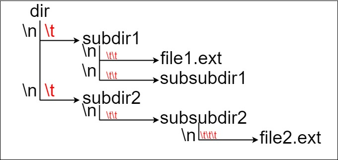

### July 20, 2021
### Type: String. Question numbers: 306, 388, 459
 306. Additive Number (Medium)   
Additive number is a string whose digits can form additive sequence.

A valid additive sequence should contain __at least__ three numbers. Except for the first two numbers, each subsequent number in the sequence must be the sum of the preceding two.

Given a string containing only digits __'0'-'9'__, write a function to determine if it's an additive number.

Note: Numbers in the additive sequence cannot have leading zeros, so sequence __1, 2, 03__ or __1, 02, 3__ is invalid.

 388. Longest Absolute File Path (Medium) -- Recommend  
Suppose we have a file system that stores both files and directories. An example of one system is represented in the following picture:

Here, we have __dir__ as the only directory in the root. __dir__ contains two subdirectories, __subdir1__ and __subdir2__. __subdir1__ contains a file __file1.ext__ and subdirectory __subsubdir1__. __subdir2__ contains a subdirectory __subsubdir2__, which contains a file __file2.ext__.

In text form, it looks like this (with ⟶ representing the tab character):

    dir
    ⟶ subdir1
    ⟶ ⟶ file1.ext
    ⟶ ⟶ subsubdir1
    ⟶ subdir2
    ⟶ ⟶ subsubdir2
    ⟶ ⟶ ⟶ file2.ext

If we were to write this representation in code, it will look like this: __"dir\n\tsubdir1\n\t\tfile1.ext\n\t\tsubsubdir1\n\tsubdir2\n\t\tsubsubdir2\n\t\t\tfile2.ext"__. Note that the __'\n'__ and __'\t'__ are the new-line and tab characters.

Every file and directory has a unique __absolute path__ in the file system, which is the order of directories that must be opened to reach the file/directory itself, all concatenated by __'/'s__. Using the above example, the __absolute path__ to __file2.ext__ is __"dir/subdir2/subsubdir2/file2.ext"__. Each directory name consists of letters, digits, and/or spaces. Each file name is of the form __name.extension__, where __name__ and __extension__ consist of letters, digits, and/or spaces.

Given a string __input__ representing the file system in the explained format, return *the length of the __longest absolute path__ to a __file__ in the abstracted file system*. If there is no file in the system, return __0__.

 459. Repeated Substring Pattern (Easy)  
Given a string __s__, check if it can be constructed by taking a substring of it and appending multiple copies of the substring together.
